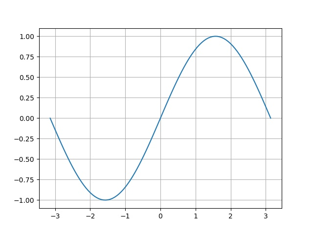

# Create-Graph


## Getting started

- In the RapsberryPi terminal, install/update NumPy and MatPlotLib:
```
sudo apt install python3-matplotlib python3-numpy
```

- In a terminal session from this folder, execute:
```
python -m create-graph
```
Note that the first time you run an application with matplotlib, you'll see:
```
Matplotlib is building the font cache; this may take a moment.
```
Do not interrupt your program. It should take a few seconds

Once the application has ran, you should see the file 'singraph.jpeg' in an SCP session, refresh the view, and you can 'open' the file to see:


